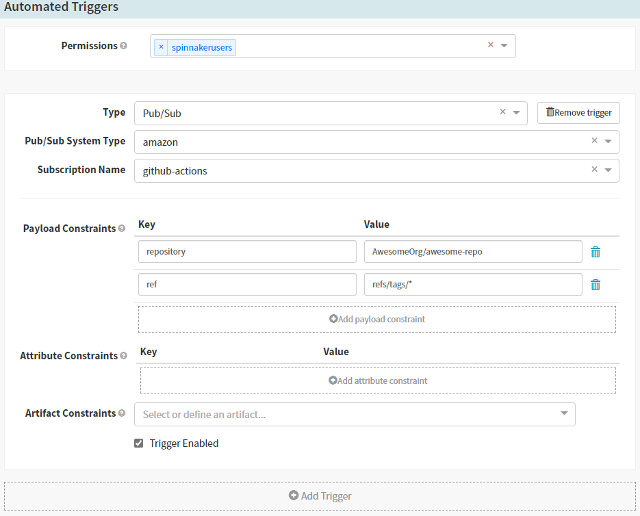
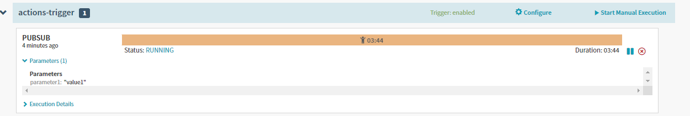

# spinnaker-pipeline-trigger

Trigger Spinnaker pipelines from Actions


## Usage

Include `ExpediaGroup/spinnaker-pipeline-trigger` as final step in workflow to trigger Spinnaker.

### Basic

```yaml
steps:
  - name: Spinnaker
    uses: ExpediaGroup/spinnaker-pipeline-trigger@v1
    with:
      topic_arn: ${{ secrets.SPINNAKER_TOPIC_ARN }}
```

Configure the pipeline trigger as below, entering your org/repo in the `repository` key:



### Default Parameters

The action sends the following information in the payload:

- repository: The owner and repository name. For example, `octocat/Hello-World`.
- commit: The commit SHA that triggered the workflow. For example, `ffac537e6cbbf934b08745a378932722df287a53`.
- ref: The branch or tag ref that triggered the workflow. For example, `refs/heads/feature-branch-1`. If neither a branch or tag is available for the event type, the variable will not exist.
- githubEventName: The name of the webhook event that triggered the workflow.
- githubActor: The name of the person or app that initiated the workflow. For example, octocat.
- githubAction: Always set to true when GitHub Actions is running the workflow. You can use this variable to differentiate when tests are being run locally or by GitHub Actions.

### Additional Parameters

To pass additional parameters to the pipeline execution context, include the `parameters` input. Each key/value pair will be passed to Spinnaker and can be used in pipeline steps.

```yaml
steps:
  - name: Spinnaker
    uses: ExpediaGroup/spinnaker-pipeline-trigger@v1
    with:
      topic_arn: ${{ secrets.SPINNAKER_TOPIC_ARN }}
      parameters: |
        parameter1: value1
```

Parameters are automatically added to `Parameters` of the pipeline. There is no need to define them separately.



## Requirements

This action uses SNS to send the message to Spinnaker. Permissions and configuraiton are needed for the runner and Spinnaker.

### Runner

The runner requires `sns:Publish` permissions. If using a public runner, something like [configure-aws-credentials](https://github.com/marketplace/actions/configure-aws-credentials-action-for-github-actions) can be used.

### Spinnaker

Follow Spinnaker's directions for [setting up a topic and queue](https://spinnaker.io/setup/triggers/amazon/) with the following modifications.

- Do not set up the S3 notification
- `messageFormat` should be `CUSTOM`
- Include the template below with the `echo` portion of the config.

Sample message format based on the default parameters being sent:

```json
[
  {
    "reference": "{{ reference }}",
    "repository": "{{ repository }}",
    "commit": "{{ commit }}",
    "ref": "{{ ref }}",
    "githubEventName": "{{ githubEventName }}",
    "githubActor": "{{ githubActor }}",
    "githubAction": "{{ githubAction }}"
  }
]
```

## Contributions

- Run `yarn all` locally before committing.
- Coverage limits are set at 90%.
- Follow semantic-release commit formatting.
