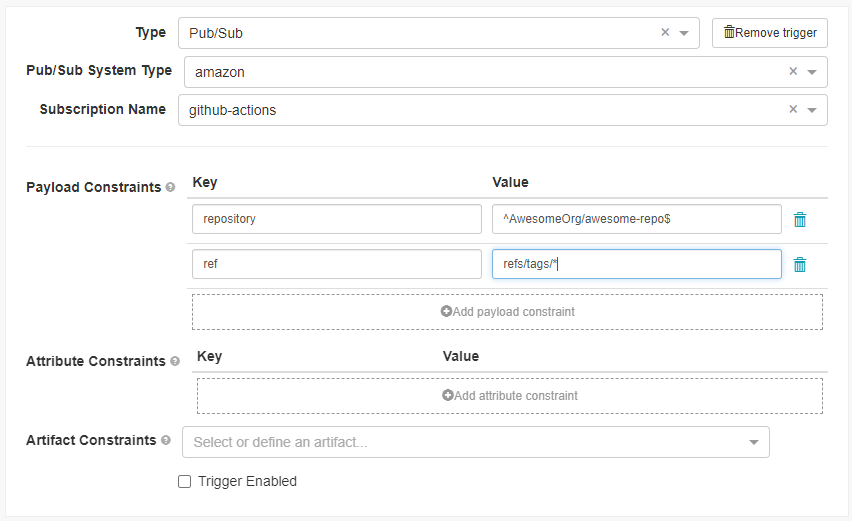
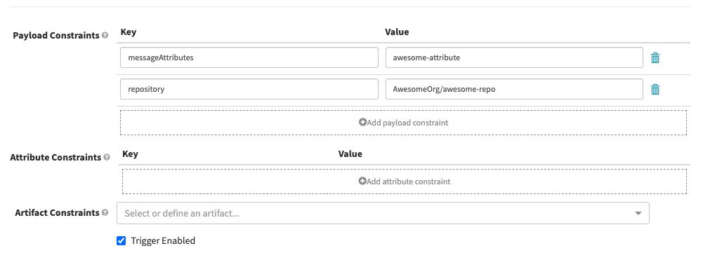

# spinnaker-pipeline-trigger

Trigger Spinnaker pipelines from Actions


## Usage

Include `ExpediaGroup/spinnaker-pipeline-trigger` as final step in workflow to trigger Spinnaker.

### Basic

```yaml
steps:
  - name: Spinnaker
    uses: ExpediaGroup/spinnaker-pipeline-trigger@v1
    with:
      github_token: ${{ secrets.GITHUB_TOKEN }}
      topic_arn: ${{ secrets.SPINNAKER_TOPIC_ARN }}
```

Configure the pipeline trigger as example below, adjusting the `Payload Constraints` as needed:

* `repository`: the `org/repo` repository key.
* `ref`: match the ref used to trigger the workflow. Ex. `main` if the ref is for a merge to the main branch or `refs/tags/*` for when a new tag is created.

NOTE: The `Payload Constraints` fields are regex values. To only include a specific `repository`, `ref`, or other constraint, be specific. Example: `^AwesomeOrg/awesome-repo$` to include ONLY that repository.



### Default Parameters

The action sends the following information in the payload:

* repository: The owner and repository name. For example, `octocat/Hello-World`.
* commit: The commit SHA that triggered the workflow. For example, `ffac537e6cbbf934b08745a378932722df287a53`.
* ref: The branch or tag ref that triggered the workflow. For example, `refs/heads/feature-branch-1`. If neither a branch or tag is available for the event type, the variable will not exist.
* githubEventName: The name of the webhook event that triggered the workflow.
* githubActor: The name of the person or app that initiated the workflow. For example, octocat.
* githubAction: Always set to true when GitHub Actions is running the workflow. You can use this variable to differentiate when tests are being run locally or by GitHub Actions.
* githubApiUrl: The base URL for the REST API endpoint for your GitHub instance. For example, `https://api.github.com`. This is used to construct Artifact objects for each of the modified or added files when present.
* modifiedFiles: A list of all the modified or added files in the commmit that triggered the workflow. For example, `["README.md", ".github/workflows/release.yaml"]`. If the `github_token` parameter is missing from the step config, or if the list of modified files is so large the SNS message body would exceed 256 KB, this value is set to an empty list instead.

### Additional Parameters

To pass additional parameters to the pipeline execution context, include the `parameters` input. Each key/value pair will be passed to Spinnaker and can be used in pipeline steps.

```yaml
steps:
  - name: Spinnaker
    uses: ExpediaGroup/spinnaker-pipeline-trigger@v1
    with:
      github_token: ${{ secrets.GITHUB_TOKEN }}
      topic_arn: ${{ secrets.SPINNAKER_TOPIC_ARN }}
      parameters: |
        parameter1: value1
```

Parameters are automatically added to `Parameters` of the pipeline. There is no need to define them separately.


### Message Attributes

To trigger a particular pipeline in a Spinnaker project with multiple pipelines, include the `message_attributes` input.
Then add the corresponding message attributes to the `Payload Constraints` of the pipeline you wish to trigger.

```yaml
steps:
  - name: Spinnaker
    uses: ExpediaGroup/spinnaker-pipeline-trigger@v1
    with:
      github_token: ${{ secrets.GITHUB_TOKEN }}
      topic_arn: ${{ secrets.SPINNAKER_TOPIC_ARN }}
      parameters: |
        parameter1: value1
      message_attributes: awesome-attribute
```



## Requirements

This action uses SNS to send the message to Spinnaker. Permissions and configuraiton are needed for the runner and Spinnaker.

### Runner

The runner requires `sns:Publish` permissions. If using a public runner, something like [configure-aws-credentials](https://github.com/marketplace/actions/configure-aws-credentials-action-for-github-actions) can be used.

### Spinnaker

Follow Spinnaker's directions for [setting up a topic and queue](https://spinnaker.io/setup/triggers/amazon/) with the following modifications.

* Do not set up the S3 notification
* `messageFormat` should be `CUSTOM`
* Include the template below with the `echo` portion of the config to receive GitHub file artifacts on the triggered pipelines. If you are running Echo in sharded mode, this config should be included in the scheduler instances.

Sample message format based on the default parameters being sent:
```json
[
  
  {
    "customKind": false,
    "reference": "{{ githubApiUrl }}/repos/{{ repository }}/contents/{{ item }}",
    "metadata": {},
    "name": "{{ item }}",
    "type": "github/file",
    "version": "{{ commit }}"
  },
  
]
```

## License

The scripts and documentation in this project are released under the [Apache 2 License](https://github.com/ExpediaGroup/spinnaker-pipeline-trigger/blob/main/LICENSE).

## Contributions

* Run `yarn all` locally before committing.
* Coverage limits are set at 90%.
* Follow semantic-release commit formatting.
